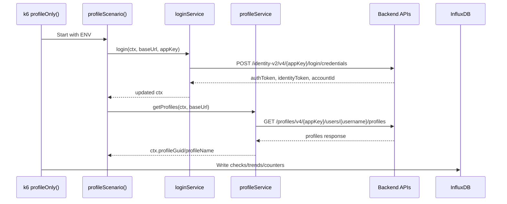

# Architecture and Flow Diagrams

This page documents the framework architecture and end-to-end execution flows.

## 1. High-Level Architecture

```mermaid
flowchart LR
  U[Tester / CI Pipeline] --> K6[k6 Runner\ntests/main.test.js]

  subgraph Framework Code
    S[config/scenarios.js]
    E[config/environments.js]
    F[scenarios/*.scenario.js]
    SV[services/*.js]
    D[data/users.json]
    C[context/userContext.js]
    R[reports/summary.html]
  end

  K6 --> S
  K6 --> E
  K6 --> F
  F --> C
  F --> D
  F --> SV

  SV --> API[Target APIs\n(identity, profiles, etc.)]
  K6 -->|metrics| I[(InfluxDB:8086\nDB: k6)]
  I --> G[Grafana:3000]
  I --> CH[Chronograf:8888]

  K6 --> R
```

## 2. k6 Runtime Execution Flow

```mermaid
flowchart TD
  A[Start command\nSCENARIO=... ENV=... k6 run] --> B[Load tests/main.test.js]
  B --> C[Import options from config/scenarios.js]
  C --> D{SCENARIO provided?}
  D -->|Yes| E[Run only selected scenario]
  D -->|No| F[Run all configured scenarios]

  E --> G[Call exec function\nloginOnly/profileOnly/e2e]
  F --> G

  G --> H[Resolve environment\nENV=stg|qa]
  H --> I[Build user context]
  I --> J[Execute scenario steps]
  J --> K[Service layer HTTP calls]
  K --> L[Validate checks + parse response]
  L --> M[Emit metrics]

  M --> N[(InfluxDB)]
  N --> O[Grafana dashboards]

  M --> P[handleSummary()]
  P --> Q[reports/summary.html + console summary]
```

## 3. Example API Sequence (Profile Scenario)



## 4. Component Ownership Map

- `tests/main.test.js`: Entry point, exports k6 exec functions, summary generation.
- `config/scenarios.js`: Scenario definitions, executor model, runtime filtering via `SCENARIO`.
- `config/environments.js`: Environment variables and API host/appKey mapping.
- `scenarios/*.scenario.js`: Business flow orchestration.
- `services/*.js`: Individual endpoint calls, checks, response parsing.
- `utils/*.js`: Shared headers, user selection, crypto helpers, data loading.
- `docker-compose.yml`: Local observability stack (InfluxDB, Grafana, Chronograf).
- `grafana-datasource.yaml` / `grafana-dashboard.yaml`: Grafana provisioning.
